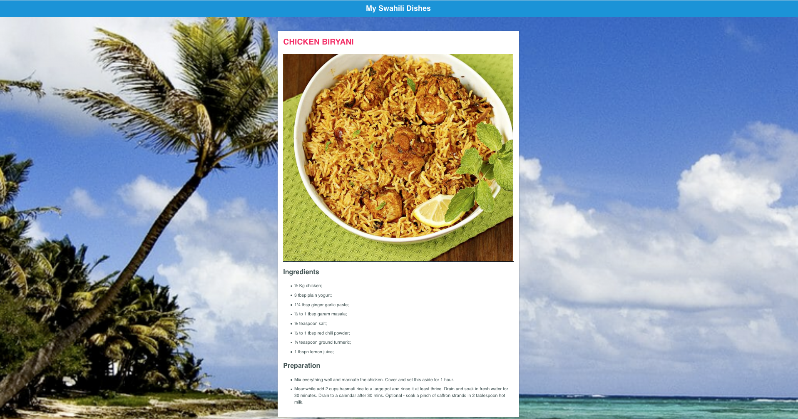

# REACTJS Web App

A sample web app to test integration of [Contentful](https://www.contentful.com/) with [AWS Amplify](https://aws.amazon.com/amplify/).




### Topics we'll be covering:

- [Authentication with Amazon Cognito](https://github.com/syumaK/FoodBlog_AmplifyContentful#adding-authentication)
- [CMS with Contentful](https://github.com/syumaK/FoodBlog_AmplifyContentful#working-with-storage)
- [Analytics with Amazon Pinpoint](https://github.com/syumaK/FoodBlog_AmplifyContentful#adding-analytics)
- [Hosting with Amazon Amplify console](https://github.com/syumaK/FoodBlog_AmplifyContentful#hosting)
- [Removing / Deleting Services](https://github.com/syumaK/FoodBlog_AmplifyContentful#removing-services)

Getting started
=====

## Requirements

To deploy this project, you'll need the following:

- [AWS account](https://aws.amazon.com/resources/create-account/)
- [Contentful](https://www.contentful.com/sign-up/ )
- [Node JS](https://nodejs.org/en/)
- [Amplify CLI](https://docs.amplify.aws/cli/start/install)

# Usage

## Prepare working directory

Clone/Fork repository.

- git clone https://github.com/syumaK/FoodBlog_AmplifyContentful.git

Install dependencies.

- `yarn install`

OR

Create a new project using the [Create React App CLI](https://github.com/facebook/create-react-app).


```bash
npx create-react-app foodblog-amplify-contentful
```

Now change into the new app directory & install the AWS Amplify & AWS Amplify React libraries:

```bash
cd foodblog-amplify-contentful

npm install --save aws-amplify @aws-amplify/ui-react

# or

yarn add aws-amplify @aws-amplify/ui-react
```

### `Initializing a new AWS Amplify Project`

```bash
amplify init

- ? Enter a name for the project: foodblogamplifycontentful

The following configuration will be applied:
    
- Name: foodblogamplifycontentful 
- Environment: dev
- Default editor: Visual Studio Code
- App type : javascript
- Javascript framework: react
- Source Directory Path: src
- Distribution Directory Path: build
- Build Command: npm run-script build
- Start Command: npm run-script start

- ? Initialize the project with the above configuration? (Y/n)
Using default provider  awscloudformation
- ? Select the authorization method you want to use: (use arrow keys)
> AWS profile
> AWS access keys
```
The Amplify init command CLI initializes a new project & you will see a new folder: __amplify__ & a new file called __aws-exports.js__ in the root directory. These files hold your project configuration.

To view the status of the amplify project at any time, you can run the Amplify `status` command:

```sh
$ amplify status
```

### `Adding Authentication`

To add authentication to our web application, we can use the following command:

```sh
$ amplify add auth

? Do you want to use default authentication and security configuration? (Use arrow keys) 
> Default configuration
> Default configuration with Social Provider (Federation)
> Manual configuration
> I want to learn more.

```

Now, we'll run the `push` command and the cloud resources will be created in our AWS account.

```bash
amplify push
```
```bash
✔ Successfully pulled backend environment dev from the cloud.

Current Environment: dev

| Category | Resource name    | Operation | Provider plugin   |
| -------- | ---------------- | --------- | ----------------- |
| Auth     | foodblog9a5f7e3a | Create    | awscloudformation |
? Are you sure you want to continue? Yes
```

### `Configuring the React application`

Now, our resources are created & we can start using them!

The first thing we need to do is to configure our React application to be aware of our new AWS Amplify project. We can do this by referencing the auto-generated `aws-exports.js` file that is now in our src folder.

To configure the app, open __src/index.js__ and add the following code below the last import:

```js
import Amplify from 'aws-amplify'
import config from './aws-exports'
Amplify.configure(config)
```

Now, our app is ready to start using our AWS services.

### `Using the withAuthenticator component`

To add authentication, we'll go into __src/App.js__ and first import the `withAuthenticator` HOC (Higher Order Component) from `@aws-amplify/ui-react`:

```js
import { withAuthenticator } from '@aws-amplify/ui-react'
```

Next, we'll wrap our default export (the App component) with the `withAuthenticator` HOC:

```js
export default withAuthenticator(App)
```

Now, we can run the app and see that an Authentication flow has been added in front of our App component. This flow gives users the ability to sign up & sign in.

> To view users that have been created in Cognito at any time, visit the Cognito dashboard by running `amplify console auth`.

### `Adding Contentful`

This repo currently uses an existing Contentful space. If you'd like to replace this space with your own, so you can modify the content, you're welcome to do so.

#### `Import Via ContentModel.io (Content Models only)`

Head to [ContentModel.io/content-models/IYQ0KGZKQfy](https://contentmodel.io/content-models/IYQ0KGZKQfy) for an export of the Content Model used in this example. You can click import into Contentful and then follow the instructions on the website to import it into your Contentful Space. You'll need to head into Contentful to create Content for this example. 

#### `Import Via the Contentful CLI (Content or Content Models)`

* Create a new space using the [Contentful CLI](https://github.com/contentful/contentful-cli)

```console
$ contentful space create --name "foodblog-amplify-contentful"
? Do you want to confirm the space creation? Yes
Your user account is a member of multiple organizations. Please select the organization you would like to add your Space to.
? Please select an organization: syumaK environment (orgid)
✨  Successfully created space foodblog-amplify-contentful(rxy72bc0wknm77)
```
* Set the newly created space as default space for all further CLI operations. You'll be presented with a list of all available spaces – choose the one you just created.
```console
$ contentful space use
? Please select a space: foodblog-amplify-contentful(rxy72bc0wknm77)
Now using the 'master' Environment of Space foodblog-amplify-contentful(rxy72bc0wknm77) when the `--environment-id` option is missing.
```

* Import the provided content model (`./import/export-content-models-only.json`) into the newly created space.
    * If you'd prefer to import a version with content you can use `./import/export.json`. This will take longer given that it includes many assets from our past events.
```console
$ contentful space import --content-file import/export-content-models-only.json

┌──────────────────────────────────────────────────┐
│ The following entities are going to be imported: │
├─────────────────────────────────┬────────────────┤
│ Content Types                   │ 2              │
├─────────────────────────────────┼────────────────┤
│ Editor Interfaces               │ 2              │
├─────────────────────────────────┼────────────────┤
│ Locales                         │ 1              │
├─────────────────────────────────┼────────────────┤
│ Webhooks                        │ 0              │
├─────────────────────────────────┼────────────────┤
│ Entries                         │ 0              │
├─────────────────────────────────┼────────────────┤
│ Assets                          │ 0              │
└─────────────────────────────────┴────────────────┘
 ✔ Validating content-file
 ✔ Initialize client (1s)
 ✔ Checking if destination space already has any content and retrieving it (1s)
 ✔ Apply transformations to source data (1s)
 ✔ Push content to destination space
   ✔ Connecting to space (1s)
   ✔ Importing Locales (1s)
   ✔ Importing Content Types (4s)
   ✔ Publishing Content Types (2s)
   ✔ Importing Editor Interfaces (1s)
   ✔ Importing Assets (4s)
   ✔ Publishing Assets (0s)
   ✔ Archiving Assets (1s)
   ✔ Importing Content Entries (4s)
   ✔ Publishing Content Entries (1s)
   ✔ Archiving Entries (0s)
   ✔ Creating Web Hooks (0s)
Finished importing all data
┌───────────────────────┐
│ Imported entities     │
├───────────────────┬───┤
│ Locales           │ 1 │
├───────────────────┼───┤
│ Content Types     │ 2 │
├───────────────────┼───┤
│ Editor Interfaces │ 2 │
├───────────────────┼───┤
│ Assets            │ 0 │
├───────────────────┼───┤
│ Published Assets  │ 0 │
├───────────────────┼───┤
│ Archived Assets   │ 0 │
├───────────────────┼───┤
│ Entries           │ 0 │
├───────────────────┼───┤
│ Published Entries │ 0 │
├───────────────────┼───┤
│ Archived Entries  │ 0 │
├───────────────────┼───┤
│ Webhooks          │ 0 │
└───────────────────┴───┘
The import took a few seconds (13s)
No errors or warnings occurred
The import was successful.
```

### `Adding Analytics`

To add analytics, we can use the following command:

```sh
amplify add analytics
```

> Next, we'll be prompted for the following:

? Provide your pinpoint resource name: __amplifyanalytics__   
? Apps need authorization to send analytics events. Do you want to allow guest/unauthenticated users to send analytics events (recommended when getting started)? __Y__   
? overwrite YOURFILEPATH-cloudformation-template.yml __Y__

#### `Recording events`

Now that the service has been created we can now begin recording events.

To record analytics events, we need to import the `Analytics` class from Amplify & then call `Analytics.record`:

```js
import { Analytics } from 'aws-amplify'

state = {username: ''}

async componentDidMount() {
  try {
    const user = await Auth.currentAuthenticatedUser()
    this.setState({ username: user.username })
  } catch (err) {
    console.log('error getting user: ', err)
  }
}

recordEvent = () => {
  Analytics.record({
    name: 'My test event',
    attributes: {
      username: this.state.username
    }
  })
}

<button onClick={this.recordEvent}>Record Event</button>
```

### `Removing Services`

If at any time, or at the end of this workshop, you would like to delete a service from your project & your account, you can do this by running the `amplify remove` command:

```sh
amplify remove auth

amplify push
```

If you are unsure of what services you have enabled at any time, you can run the `amplify status` command:

```sh
amplify status
```

`amplify status` will give you the list of resources that are currently enabled in your app.